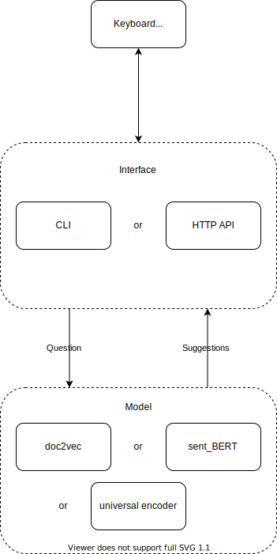

# QNA Module

This is the 'guts' of the project. This does the natural language processing (NLP) to match the current question to previously asked questions.

# Starting the app

Requires python 3.8+

Please also note the python modules required, listed [below](#requirements).

```
python3 ./src/main.py
```

# Structure

The project has been built with interfaces for the major components to allow for a greater level of modularity.

## docker

The docker package contains the content deployed to the server,Therefore, you can use the docker command to deploy this project to docker.

##  docs

The docs package contains the structure diagram of the project file, as shown below.

## frontend

The frontend package contains the web page files for front-end user interaction and display of the application, and style.css is used for layout and beautification.

## nginx

The nginx package contains the configuration of this application deployment, which is deployed to the front end using nginx.

##  qna

### main.py

`main.py` builds the question matcher and the user interface, links them, and then triggers the UI's main input loop.

The `qna` module is structured as shown below. The 'user' interacts with the `interface` that then translates the request to a form that the model can process. The model gives suggestions based on the question, and then these suggestions are transmitted  back to the 'user' by the `interface`.



### domain

The domian package contains the entities required for this project.

#### `AbstractQuestionMatcher`

This defines the question matcher, the core of the application.

Concrete question matcher implementations must be a subclass of this abstract matcher and implement all abstract methods. Question matchers are consumed by User Interfaces.

#### `AbstractUserInterface`

This defines the user interface, the component that allows the user to interact with the question matcher.

Concrete user interface implementations must be a subclass and implement all abstract methods.

### interface

The interface package contains the interfaces required for the project, including instantiation, web page display, user-defined interfaces, etc.

### parser

The parser package contains loaders and parsers, and uses JSON files for data interaction between the front and back ends.

### pretrained

The pre trained package contains the model and results of pre training.

### testfiles

The testfiles package contains the data of the test set and is stored in a TXT file.

# Requirements

## Python modules

* `gensim`
  `pip install --upgrade gensim`
  or 
  `conda install -c conda-forge gensim`
* `nltk`
  run `pip install --user -U nltk`
* `sklearn`
  `pip install -U scikit-learn `
* `sentence_transformers`
  `pip install -U sentence-transformers`
* `tensorflow`
  `pip3 install --user --upgrade tensorflow  # install in $HOME`
* `tensorflow_hub`
  `!pip install --upgrade tensorflow_hub`
* `scipy`
  `python3 -m pip install -U scipy`
* `numpy`
  `pip install numpy`
* `pandas`
  `pip install pandas`
  
# Data

This app relies on previous QnA data. This data, although not highly sensitive, should not be publicly shared so that risk is minimised. To achieve this all data should be stored in `./data`. This directory is included in `.gitignore` to help prevent accidental upload.
